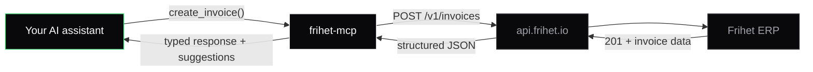

<p align="center">
  <picture>
    <source media="(prefers-color-scheme: dark)" srcset="./assets/banner.svg">
    <source media="(prefers-color-scheme: light)" srcset="./assets/banner-light.svg">
    
  </picture>
</p>

<p align="center">
  <strong>AI-native MCP server for business management.</strong><br/>
  <em>Servidor MCP nativo con IA para gestión empresarial.</em>
</p>

<p align="center">
  <a href="https://www.npmjs.com/package/@frihet/mcp-server"></a>
  <a href="https://www.npmjs.com/package/@frihet/mcp-server"></a>
  <a href="https://smithery.ai/server/frihet/frihet-mcp"></a>
  <a href="https://registry.modelcontextprotocol.io/?q=io.frihet"></a>
  <a href="https://github.com/Frihet-io/frihet-mcp/blob/main/LICENSE"></a>
  
  =18">
  <a href="https://www.typescriptlang.org/"></a>
</p>

---

## Distribution

| Channel | Status | Install |
|---------|--------|---------|
| **npm** | Live | `npx @frihet/mcp-server` |
| **Remote endpoint** | Live | `https://mcp.frihet.io/mcp` (zero install, OAuth or API key) |
| **Smithery** | Live | [smithery.ai/server/frihet/frihet-mcp](https://smithery.ai/server/frihet/frihet-mcp) |
| **MCP Registry** | Live | [registry.modelcontextprotocol.io](https://registry.modelcontextprotocol.io/?q=io.frihet) |
| **Glama** | Live | [glama.ai/mcp/servers/@Frihet-io/frihet-mcp](https://glama.ai/mcp/servers/@Frihet-io/frihet-mcp) |
| **mcp.so** | Auto-index (unverified) | [mcp.so](https://mcp.so) — indexes from npm + GitHub |
| **PulseMCP** | Auto-index (unverified) | [pulsemcp.com](https://pulsemcp.com) — indexes from npm + GitHub |
| **Cursor Marketplace** | Coming soon | [cursor.com/marketplace](https://cursor.com/marketplace) |
| **ChatGPT Apps** | Coming soon | [chatgpt.com](https://chatgpt.com) |
| **Anthropic Claude Directory** | Coming soon | [claude.ai/settings/connectors](https://claude.ai/settings/connectors) |

> **Tool count:** the 151-tool build is on `@beta` (`npx @frihet/mcp-server@beta`). npm `latest` (1.6.x) currently ships 62 tools — a stable 151-tool release is pending. The remote endpoint (`mcp.frihet.io`) already serves all 151.

---

## What is this

An MCP server that connects your AI assistant to [Frihet](https://frihet.io). Create invoices by talking. Query expenses in natural language. Manage your entire business from your IDE.

```
You:     "Create an invoice for TechStart SL, 40 hours of consulting at 75 EUR/hour, due March 1st"
Claude:  Done. Invoice INV-2026-089 created. Total: 3,000.00 EUR + 21% IVA = 3,630.00 EUR.
```

151 tools. 8 resources. 7 prompts. Structured output on every tool. Zero boilerplate.

<!-- v1.12.0-beta.1 — D4-B megasprint: HR (9), payroll (2), onboarding (2), permissions (2), period close (3), webhook test (1) = +19 = 151 tools total -->

---

## Install

### One-line (Claude Code, Cursor, Copilot, Codex, Windsurf, Gemini CLI, and more)

```bash
npx skills add Frihet-io/frihet-mcp
```

### Claude Code / Claude Desktop

```json
{
  "mcpServers": {
    "frihet": {
      "command": "npx",
      "args": ["-y", "@frihet/mcp-server"],
      "env": {
        "FRIHET_API_KEY": "fri_your_key_here"
      }
    }
  }
}
```

| Tool | Config file |
|------|------------|
| Claude Code | `~/.claude/mcp.json` |
| Claude Desktop | `~/Library/Application Support/Claude/claude_desktop_config.json` |
| Cursor | `.cursor/mcp.json` or `~/.cursor/mcp.json` |
| Windsurf | `~/.windsurf/mcp.json` |
| Cline | VS Code settings or `.cline/mcp.json` |
| Codex CLI | `~/.codex/config.toml` (MCP section) |

The JSON config is identical for all tools. Only the file path changes.

### Remote (no install)

Use the hosted endpoint at `mcp.frihet.io` -- zero local dependencies, runs on Cloudflare Workers.

**With API key:**

```json
{
  "mcpServers": {
    "frihet": {
      "type": "streamable-http",
      "url": "https://mcp.frihet.io/mcp",
      "headers": {
        "Authorization": "Bearer fri_your_key_here"
      }
    }
  }
}
```

**With OAuth 2.0 + PKCE** (browser-based login, no API key needed):

Clients that support OAuth (Claude Desktop, Smithery, etc.) can connect directly to `https://mcp.frihet.io/mcp` and authenticate via browser. The server implements the full OAuth 2.1 authorization code flow with PKCE.

### Get your API key

1. Log into [app.frihet.io](https://app.frihet.io)
2. Go to **Settings > API**
3. Click **Create API key**
4. Copy the key (starts with `fri_`) -- it's only shown once

---

## What you can do

Talk to your ERP. These are real prompts, not marketing copy.

### Invoicing

```
"Show me all unpaid invoices"
"Create an invoice for Acme SL with 10h of consulting at 95/hour"
"Mark invoice abc123 as paid"
"How much has ClientName been invoiced this year?"
```

### Expenses

```
"Log a 59.99 EUR expense for Adobe Creative Cloud, category: software, tax-deductible"
"List all expenses from January"
"What did I spend on travel last quarter?"
```

### Clients

```
"Add a new client: TechStart SL, NIF B12345678, email admin@techstart.es"
"Show me all my clients"
"Update ClientName's address to Calle Mayor 1, Madrid 28001"
```

### CRM

```
"Add a contact to Acme SL: Ana Garcia, CTO, ana@acme.es"
"Log a call with TechStart: discussed Q2 proposal, they're interested in upgrade"
"Add a note to ClientName: prefers invoices in English, payment NET 30"
"Show me all activities for Acme SL"
```

### Quotes

```
"Create a quote for Design Studio: logo design (2000 EUR) + brand guidelines (3500 EUR)"
"Show me all pending quotes"
```

### Webhooks

```
"Set up a webhook to notify https://my-app.com/hook when invoices are paid"
"List all my active webhooks"
```

---

## What to expect

This MCP is a **structured data interface** -- you describe what you want in natural language, and the AI creates, queries, or modifies business records in Frihet. All 151 tools are CRUD operations over the REST API.

**Works great:**

```
"Create an invoice for TechStart SL, 40h consulting at 75 EUR/h"   --> creates the invoice
"Show unpaid invoices over 1,000 EUR"                               --> queries and filters
"Log a 120 EUR expense for the Madrid train, category: travel"      --> records the expense
"Update client Acme's email to billing@acme.es"                     --> modifies the record
```

**Does not do:**

- OCR or PDF scanning -- you cannot upload an invoice image and have it read
- File upload or attachment handling
- Image processing of any kind

If you need to digitize paper invoices or receipts, extract the data first (e.g., Claude Vision API, a dedicated OCR service, or manual entry), then use the MCP to create the record:

```
1. Scan/photograph the invoice
2. Use Claude Vision: "Read this invoice image and extract the vendor, items, amounts, and dates"
3. Then: "Create an expense in Frihet for [extracted data]"
```

---

## Tools (151)

### Invoices (12)

| Tool | What it does |
|------|-------------|
| `list_invoices` | List invoices with pagination |
| `get_invoice` | Get full invoice details by ID |
| `create_invoice` | Create a new invoice with line items |
| `update_invoice` | Update any invoice field |
| `delete_invoice` | Permanently delete an invoice |
| `search_invoices` | Find invoices by client name, date, or status |
| `send_invoice` | Email invoice to client (PDF attachment) |
| `mark_invoice_paid` | Mark an invoice as paid with optional payment date |
| `get_invoice_pdf` | Get a download URL for the invoice PDF |
| `get_invoice_einvoice` | Get the e-invoice XML for a given invoice ID |
| `create_credit_note` | Create a credit note linked to an existing invoice |
| `apply_late_fee` | Apply a late payment fee to an overdue invoice |

### Expenses (5)

| Tool | What it does |
|------|-------------|
| `list_expenses` | List expenses with pagination |
| `get_expense` | Get expense details |
| `create_expense` | Record a new expense |
| `update_expense` | Modify an expense |
| `delete_expense` | Delete an expense |

### Clients (5)

| Tool | What it does |
|------|-------------|
| `list_clients` | List all clients |
| `get_client` | Get client details |
| `create_client` | Register a new client |
| `update_client` | Update client info |
| `delete_client` | Remove a client |

### CRM: Contacts (3)

| Tool | What it does |
|------|-------------|
| `list_client_contacts` | List all contacts for a client |
| `create_client_contact` | Add a contact person to a client |
| `delete_client_contact` | Remove a contact from a client |

### CRM: Activities (2)

| Tool | What it does |
|------|-------------|
| `list_client_activities` | List CRM activities (calls, emails, meetings, tasks) |
| `log_client_activity` | Log a call, email, meeting, or task against a client |

### CRM: Notes (3)

| Tool | What it does |
|------|-------------|
| `list_client_notes` | List all notes for a client |
| `create_client_note` | Add a free-form note to a client |
| `delete_client_note` | Remove a note from a client |

### Products (5)

| Tool | What it does |
|------|-------------|
| `list_products` | List products and services |
| `get_product` | Get product details |
| `create_product` | Add a product or service |
| `update_product` | Update pricing or details |
| `delete_product` | Remove a product |

### Quotes (6)

| Tool | What it does |
|------|-------------|
| `list_quotes` | List all quotes |
| `get_quote` | Get quote details |
| `create_quote` | Draft a new quote |
| `update_quote` | Modify a quote |
| `delete_quote` | Delete a quote |
| `send_quote` | Email quote to client for acceptance |

### Webhooks (6)

| Tool | What it does |
|------|-------------|
| `list_webhooks` | List configured webhooks |
| `get_webhook` | Get webhook details |
| `create_webhook` | Register a new webhook endpoint |
| `update_webhook` | Modify events or URL |
| `delete_webhook` | Remove a webhook |
| `test_webhook` | Send a test payload to a configured webhook endpoint |

### Intelligence (4)

| Tool | What it does |
|------|-------------|
| `get_business_context` | Full snapshot: profile, plan, recent activity, top clients, current month |
| `get_monthly_summary` | Monthly P&L: revenue, expenses, profit, tax liability, top clients by revenue |
| `get_quarterly_taxes` | Quarterly tax prep: Modelo 303/130 fields, collected vs deductible, liability |
| `duplicate_invoice` | Clone an invoice for recurring billing (copies items/client/tax, starts as draft) |

### E-Invoicing (10)

> **Status: beta.** Tools call `api.frihet.io/v1/einvoice/*` directly. If an endpoint is not yet deployed (404), the tool falls back to `{ _stub: true, _note: "CF endpoint pending deploy", _plannedEndpoint: "..." }` so the server remains usable while transport ships.

| Tool | What it does |
|------|-------------|
| `send_einvoice` | Dispatch an invoice in 11 formats (XRechnung, Factur-X, FatturaPA, PEPPOL, Facturae, UBL, CII) via email / Chorus Pro / SDI / PEPPOL / download |
| `get_einvoice_status` | Poll Hatchet workflow run status until succeeded/failed — returns ackId, XML URL, PDF/A-3 URL |
| `validate_einvoice_xml` | Validate raw XML against format schema + schematron rules (KOSIT / Mustang / XSD / Schematron) |
| `export_datev` | Export accounting data as DATEV EXTF (Buchungsstapel / Debitoren / Kreditoren) in CP1252 encoding |
| `einvoice_export` | Export e-invoice data in machine-readable formats (JSON/XML) for archival or integration |
| `face_submit` | Submit invoice to FACe (Spain B2G government e-invoicing platform) |
| `face_status` | Poll submission status from FACe for a submitted invoice |
| `ticketbai_submit` | Submit TicketBAI fiscal record to Basque Country tax authority (Hacienda) |
| `ticketbai_status` | Poll TicketBAI submission status from the Basque tax authority |
| `ksef_submit` | Submit invoice to KSeF (Poland national e-invoicing system — stub) |

### Time Tracking (6)

> **Status: stub** — `/v1/time/*` endpoints planned. Tools surface 404 until backend ships.

| Tool | What it does |
|------|-------------|
| `list_time_entries` | List time entries with filter by user, project, date range, billable status |
| `get_time_entry` | Get full details of a single time entry by ID |
| `create_time_entry` | Log hours for a project (billable flag, description, date) |
| `update_time_entry` | Update any field on an existing time entry (PATCH semantics) |
| `delete_time_entry` | Soft-delete a time entry (confirm=true required) |
| `get_time_summary` | Aggregate total/billable/non-billable hours for a period, with optional groupBy (user/project/day) |

### Recurring Invoices (8)

> **Status: stub** — `/v1/recurring/*` endpoints planned. Tools surface 404 until backend ships.

| Tool | What it does |
|------|-------------|
| `list_recurring_invoices` | List all recurring invoice templates (filter by active/paused) |
| `get_recurring_invoice` | Get full details of a recurring template by ID |
| `create_recurring_invoice` | Create a new recurring invoice template (daily/weekly/monthly/quarterly/yearly) |
| `update_recurring_invoice` | Update template fields — affects future generated invoices only |
| `pause_recurring_invoice` | Pause an active template — no invoices generated while paused |
| `resume_recurring_invoice` | Resume a paused template — next invoice on next scheduled cycle |
| `delete_recurring_invoice` | Permanently delete a template (confirm=true required) |
| `run_recurring_now` | Manually trigger immediate generation of the next invoice instance |

### Team Management (4)

> **Status: stub** — `/v1/team/*` endpoints planned. Tools surface 404 until backend ships.

| Tool | What it does |
|------|-------------|
| `list_team_members` | List all workspace members with role and invite status |
| `invite_team_member` | Invite a new member by email with role (admin/member/viewer) |
| `update_team_member_role` | Change an existing member's role |
| `remove_team_member` | Remove a member from the workspace (confirm=true required) |

### Gestoria — Accountants (5)

> **Status: stub** — `/v1/gestoria/*` REST surface lands with Wave Fase 1 closure (PRs #383 bulk send, #384 aging, #385 messaging). Tools surface 404 until the backend ships.

| Tool | What it does |
|------|-------------|
| `gestoria_message_send` | Send a message in a contextual thread (documentRequest / filingItem / obligation) |
| `gestoria_messages_list` | List messages in a thread, newest first; paginate backwards with `before` |
| `gestoria_template_create` | Create a reusable document request template with variables + due-date offset |
| `gestoria_template_bulk_send` | Bulk send a template to up to 500 client workspaces in one call |
| `gestoria_aging_consolidated` | Cross-client AR aging report (buckets, per-workspace breakdown, top overdue) |

### Audit GL (3)

> **Status: stub** — `/v1/gl/*` proxies callables `approveGLEntry`, `rejectGLEntry`, `getGLEntryAuditLog` (PR #395). Tools surface 404 until backend ships.

| Tool | What it does |
|------|-------------|
| `frihet_gl_entry_approve` | Approve a GL journal entry (gestor/admin only — TRUST AREA) |
| `frihet_gl_entry_reject` | Reject a GL entry with a mandatory reason (TRUST AREA) |
| `frihet_gl_entry_audit_log` | Retrieve full audit trail for a GL entry |

### White-label Portal Domain (3)

> **Status: stub** — `/v1/portal/domain/*` proxies callables `addCustomPortalDomain`, `verifyCustomPortalDomain`, `removeCustomPortalDomain` (PR #397).

| Tool | What it does |
|------|-------------|
| `frihet_portal_domain_add` | Add a custom domain to the client portal (returns DNS CNAME records) |
| `frihet_portal_domain_verify` | Verify DNS propagation for a custom portal domain |
| `frihet_portal_domain_remove` | Remove a custom portal domain (reverts to default Frihet subdomain) |

### Self-onboard & VIES (2)

> **Status: stub** — `/v1/portal/onboard/*` proxies callables `generatePortalOnboardLink`, `lookupTaxIdViaVIES` (PR #398). Public portal flows excluded from MCP.

| Tool | What it does |
|------|-------------|
| `frihet_portal_onboard_link_generate` | Generate a time-limited self-onboard link for a prospective client |
| `frihet_tax_id_vies_lookup` | Validate an EU VAT number (CIF intracomunitario) via VIES |

### IGIC — Canary Islands Indirect Tax (4)

> **Status: stub** — `/v1/igic/*` service-layer reads (PR #390). ATC SOAP excluded (internal infra).

| Tool | What it does |
|------|-------------|
| `frihet_modelo_415_summary` | M415 annual operations >€3,005 (Canarias equivalent of M347) |
| `frihet_modelo_425_summary` | M425 annual IGIC recap for Canary Islands businesses |
| `frihet_modelo_418_summary` | M418 monthly IGIC return for large enterprises (grandes empresas) |
| `frihet_aiem_calculate` | Calculate AIEM (Arbitrio Importación) for imported/produced goods in Canarias |

### Impuesto sobre Sociedades — Corporate Tax (2)

> **Status: stub** — `/v1/is/*` service-layer reads for Spanish SLs/SAs (PR #392).

| Tool | What it does |
|------|-------------|
| `frihet_modelo_200_summary` | Modelo 200 annual IS return (taxable base, deductions, net payable) |
| `frihet_modelo_202_summary` | Modelo 202 installment payments (1P April, 2P October, 3P December) |

### Bank Categorization Rules (2)

> **Status: stub** — `/v1/banking/rules` Q3-flagged (PR #394). Webhook handlers excluded.

| Tool | What it does |
|------|-------------|
| `frihet_bank_rules_list` | List all bank auto-categorization rules (conditions + actions + status) |
| `frihet_bank_rule_create` | Create a new rule to auto-categorize transactions by description, amount, counterparty |

### Deposits (7)

| Tool | What it does |
|------|-------------|
| `list_deposits` | List deposits with pagination |
| `get_deposit` | Get deposit details by ID |
| `create_deposit` | Record a new client deposit |
| `update_deposit` | Update deposit fields |
| `delete_deposit` | Delete a deposit (confirm=true required) |
| `apply_deposit` | Apply a deposit balance against an invoice |
| `refund_deposit` | Issue a refund for a deposit |

### Vendors (5)

| Tool | What it does |
|------|-------------|
| `list_vendors` | List all vendors/suppliers |
| `get_vendor` | Get vendor details |
| `create_vendor` | Add a new vendor |
| `update_vendor` | Update vendor info |
| `delete_vendor` | Remove a vendor |

### Banking (5)

| Tool | What it does |
|------|-------------|
| `list_bank_accounts` | List connected bank accounts |
| `get_bank_account` | Get details for a bank account |
| `list_transactions` | List bank transactions with filters |
| `categorize_transaction` | Assign a category and expense/income type to a transaction |
| `match_transaction_to_invoice` | Link a bank transaction to an existing invoice |

### Fiscal — Spanish Tax Models (8)

| Tool | What it does |
|------|-------------|
| `get_modelo_303_summary` | Quarterly IVA return (Modelo 303) — collected vs deductible, net payable |
| `get_modelo_130_summary` | Quarterly IRPF installment for self-employed (Modelo 130) |
| `get_modelo_390_summary` | Annual IVA summary (Modelo 390) |
| `get_modelo_180_summary` | Annual withholding summary for rentals (Modelo 180) |
| `get_modelo_347_summary` | Annual third-party transactions >€3,005 (Modelo 347) |
| `verifactu_status` | Get VeriFactu submission status for a fiscal record |
| `verifactu_resubmit` | Resubmit a rejected VeriFactu fiscal record |
| `ticketbai_status` | Poll TicketBAI submission status (also available in E-Invoicing section) |

### Vacation Rentals / Stay (5)

| Tool | What it does |
|------|-------------|
| `list_reservations` | List rental reservations with filters |
| `get_reservation` | Get reservation details |
| `create_reservation` | Create a new reservation |
| `list_properties` | List all rental properties |
| `sync_channel` | Trigger OTA channel sync (Airbnb, Booking.com, etc.) |

### POS — Point of Sale (4)

| Tool | What it does |
|------|-------------|
| `list_terminals` | List registered POS terminals |
| `get_sale` | Get details for a POS sale transaction |
| `list_sales` | List POS sales with pagination |
| `refund_sale` | Issue a refund for a POS sale |

### HR — Human Resources (9)

| Tool | What it does |
|------|-------------|
| `leave_request_create` | Create a leave request (vacation, sick, personal) |
| `leave_approve` | Approve a pending leave request |
| `leave_reject` | Reject a leave request with a reason |
| `leave_cancel` | Cancel an approved or pending leave request |
| `leave_list` | List leave requests with filters (user, status, date range) |
| `attendance_clock_in` | Record clock-in for an employee |
| `attendance_clock_out` | Record clock-out for an employee |
| `overtime_report` | Generate overtime report for a period |
| `anomaly_list` | List attendance anomalies (missing punches, excessive overtime) |

### Payroll (2)

| Tool | What it does |
|------|-------------|
| `payroll_export` | Export payroll data for a period (CSV/PDF for gestoría) |
| `payroll_checklist` | Generate pre-payroll checklist: pending leaves, anomalies, overtime |

### Onboarding (2)

| Tool | What it does |
|------|-------------|
| `onboarding_status` | Get onboarding completion status for the current workspace |
| `onboarding_persona_set` | Set or update the business persona (freelancer, SME, gestoría, etc.) |

### Permissions (2)

| Tool | What it does |
|------|-------------|
| `permissions_matrix` | Get the full permissions matrix for all roles in the workspace |
| `permissions_me` | Get the current API key's effective permissions |

### Period Close (3)

| Tool | What it does |
|------|-------------|
| `period_close_status` | Get the close status for an accounting period |
| `period_close` | Close an accounting period (gestor/admin only — TRUST AREA) |
| `period_reopen` | Reopen a closed period with a mandatory reason (TRUST AREA) |

All 151 tools return **structured output** via `outputSchema` -- typed JSON, not raw text. List tools return paginated results (`{ data, total, limit, offset }`).

---

## Resources (8)

Context the AI can read to make smarter decisions.

**Static** (reference data, no API calls):

| Resource | URI | What it provides |
|----------|-----|-----------------|
| API Schema | `frihet://api/schema` | OpenAPI summary: endpoints, auth, rate limits, pagination, error codes |
| Tax Rates | `frihet://tax/rates` | Tax rates by Spanish fiscal zone: IVA, IGIC, IPSI, EU reverse charge, IRPF |
| Tax Calendar | `frihet://tax/calendar` | Quarterly filing deadlines: Modelo 303, 130, 390, 420, VeriFactu timeline |
| Expense Categories | `frihet://config/expense-categories` | 8 categories with deductibility rules, IVA treatment, amortization |
| Invoice Statuses | `frihet://config/invoice-statuses` | Status flow (draft > sent > paid/overdue > cancelled), transition rules, webhook events |

**Dynamic** (live data from your account):

| Resource | URI | What it provides |
|----------|-----|-----------------|
| Business Profile | `frihet://business-profile` | Your business info, plan, defaults, recent activity, top clients |
| Monthly Snapshot | `frihet://monthly-snapshot` | Current month P&L, revenue, expenses, tax liability |
| Overdue Invoices | `frihet://overdue-invoices` | All invoices past due date (up to 100) |

---

## Prompts (7)

Pre-built workflows the AI can execute as guided multi-step operations.

| Prompt | What it does | Arguments |
|--------|-------------|-----------|
| `monthly-close` | Close the month: review unpaid invoices, categorize expenses, check tax obligations, generate summary | `month?` (YYYY-MM) |
| `onboard-client` | Set up a new client with correct tax rates by location, optionally create a welcome quote | `clientName`, `country?`, `region?` |
| `quarterly-tax-prep` | Prepare quarterly tax filing: calculate IVA/IGIC, identify deductibles, preview Modelo 303/130/420 | `quarter?`, `fiscalZone?` |
| `overdue-followup` | Find overdue invoices, draft follow-up messages, suggest payment reminders | -- |
| `new-client-invoice` | Create a client + first invoice in one workflow with tax rate lookup | `clientName`, `country?` |
| `expense-report` | Generate expense report grouped by category with deductible totals | `month?` (YYYY-MM) |
| `expense-batch` | Process expenses in bulk: categorize, apply tax rates, flag missing receipts | `fiscalZone?` |

---

## How it works



The server translates tool calls into REST API requests. It handles authentication, rate limiting (automatic retry with backoff on 429), pagination, and error mapping.

Two transports:
- **stdio** (local) -- `npx @frihet/mcp-server` with `FRIHET_API_KEY`
- **Streamable HTTP** (remote) -- `https://mcp.frihet.io/mcp` with Bearer token or OAuth 2.0+PKCE

### Environment variables

| Variable | Required | Default |
|----------|----------|---------|
| `FRIHET_API_KEY` | Yes (stdio) | -- |
| `FRIHET_API_URL` | No | `https://api.frihet.io/v1` |

---

## API limits

| Limit | Value |
|-------|-------|
| Requests per minute | 100 per API key |
| Results per page | 100 max (50 default) |
| Request body | 1 MB max |
| Webhook payload | 100 KB max |
| Webhooks per account | 20 max |

Rate limiting is handled automatically with exponential backoff.

---

## Claude Code Skill

Beyond raw MCP tools, this repo includes a **Claude Code skill** that adds business context: Spanish tax rules, workflow recipes, financial reports, and natural language commands.

### Install the skill

```bash
git clone https://github.com/Frihet-io/frihet-mcp.git
ln -s "$(pwd)/frihet-mcp/skill" ~/.claude/skills/frihet
```

Or with the universal installer:

```bash
npx skills add Frihet-io/frihet-mcp
```

### Commands

| Command | What it does |
|---------|-------------|
| `/frihet status` | Account overview, recent activity, pending payments |
| `/frihet invoice` | Create, list, search invoices |
| `/frihet expense` | Log and query expenses |
| `/frihet clients` | Manage client database |
| `/frihet quote` | Create and manage quotes |
| `/frihet report` | Financial summaries (P&L, quarterly, overdue) |
| `/frihet webhooks` | Configure automation triggers |
| `/frihet setup` | Guided setup and connection test |

The skill knows about IVA rates, IRPF retention, Modelo 303 prep, expense deductibility rules, and VeriFactu compliance.

Full documentation: [docs.frihet.io/desarrolladores/skill-claude-code](https://docs.frihet.io/desarrolladores/skill-claude-code)

---

## Development

```bash
git clone https://github.com/Frihet-io/frihet-mcp.git
cd frihet-mcp
npm install
npm run build
```

Run locally:

```bash
FRIHET_API_KEY=fri_xxx node dist/index.js
```

Test with the [MCP Inspector](https://modelcontextprotocol.io/docs/tools/inspector):

```bash
npx @modelcontextprotocol/inspector node dist/index.js
```

---

## Contributing

Contributions are welcome. Please open an issue first to discuss what you'd like to change.

```bash
git clone https://github.com/Frihet-io/frihet-mcp.git
cd frihet-mcp
npm install
npm run build   # must pass before submitting
```

---

## Current limitations

- **No OCR or file upload** -- the MCP works with structured data, not images or PDFs. Planned for a future release.
- **Single company** -- one API key maps to one Frihet workspace. Multi-company support is not yet available.
- **Frihet account required** -- you need an active account at [app.frihet.io](https://app.frihet.io) and an API key (starts with `fri_`).

---

## Ecosystem

| Package | What it is |
|---------|-----------|
| [`@frihet/mcp-server`](https://www.npmjs.com/package/@frihet/mcp-server) | This MCP server (151 tools, 8 resources, 7 prompts) |
| [`@frihet/sdk`](https://github.com/Frihet-io/frihet-sdk) | TypeScript SDK (`frihet.invoices.create()`) |
| [`frihet`](https://www.npmjs.com/package/frihet) | CLI (`frihet invoices list --status overdue`) |
| [`n8n-nodes-frihet`](https://www.npmjs.com/package/n8n-nodes-frihet) | n8n community node for workflow automation |
| [REST API](https://docs.frihet.io/desarrolladores/api-rest) | OpenAPI 3.1 at `api.frihet.io/v1` |
| [Remote MCP](https://mcp.frihet.io) | Hosted endpoint on Cloudflare Workers (zero install) |
| [Webhooks](https://docs.frihet.io/desarrolladores/webhooks) | Real-time events with HMAC-SHA256 |

## Links

- [Frihet](https://frihet.io) -- The product
- [Documentation](https://docs.frihet.io) -- Full docs
- [API reference](https://docs.frihet.io/desarrolladores/api-rest) -- REST API
- [MCP server docs](https://docs.frihet.io/desarrolladores/mcp-server) -- Setup guides, troubleshooting
- [npm](https://www.npmjs.com/package/@frihet/mcp-server) -- Package registry
- [Smithery](https://smithery.ai/server/frihet/frihet-mcp) -- Smithery marketplace
- [MCP Registry](https://registry.modelcontextprotocol.io/?q=io.frihet) -- Anthropic official registry
- [Remote endpoint](https://mcp.frihet.io) -- Hosted MCP server (Cloudflare Workers)
- [OpenAPI spec](https://api.frihet.io/openapi.yaml) -- Machine-readable API definition

---

## License

MIT. See [LICENSE](./LICENSE).

Built by [Frihet](https://frihet.io).
